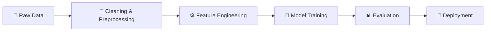

# 🚀 Spaceship Titanic: AI Analytics & Prediction System
### 🎓| Machine Learning Track

[](https://spaceship-titanic-ai-ultimate.streamlit.app/)
[](https://www.python.org/)
[](https://www.tensorflow.org/)
[](https://scikit-learn.org/)

> **🔴 Live Demo:** Click the "Streamlit" badge above or [**Try the App Here**](https://spaceship-titanic-ai-ultimate.streamlit.app/) to interact with the model!

## 📖 Project Overview
[cite_start]This project is an End-to-End Machine Learning solution for the **Spaceship Titanic** challenge[cite: 9]. [cite_start]The goal is to predict whether a passenger was transported to an alternate dimension during the spaceship's collision with a spacetime anomaly[cite: 14].

[cite_start]Instead of a traditional presentation, this repository serves as the complete documentation, covering **Data Analysis (EDA)**, **Preprocessing**, **Model Training**, **Evaluation**, and **Deployment** via a Streamlit Web App[cite: 108, 93].

---

## 🛠️ The Machine Learning Pipeline



---

## 📊 1. Exploratory Data Analysis (EDA)

We started by analyzing the dataset (`8693` records) to find patterns.

### 🔍 Key Insights:

* **Spending vs. Status:** Passengers in **CryoSleep** strictly spent **0** on services. This was a crucial finding for imputation.
* **Age Distribution:** Children (Age 0-5) were more likely to be transported than adults.
* **VIP Status:** VIP passengers accounted for a small fraction of the data but had distinct spending behaviors.

---

## 🧹 2. Data Cleaning & Feature Engineering

To prepare the data for the models, we performed the following steps:

🔹 Handling Missing Values 

* **Numerical:** Filled with `Median` to handle skewness (e.g., Age).
* **Categorical:** Filled with `Mode` (Most frequent value).
* **Smart Imputation:** If a passenger had `TotalSpend > 0`, their `CryoSleep` status was forced to `False`.

🔹 Feature Engineering (Creating New Data) 

We extracted new meaningful features to improve accuracy:

1. **`TotalSpend`:** Sum of all luxury amenities (RoomService, Spa, VRDeck, etc.).
2. **`LogTotalSpend`:** Applied Log Transformation to normalize the highly skewed spending data.
3. **`GroupSize` & `IsSolo`:** Parsed `PassengerId` to determine if a passenger was traveling alone.
4. 
**`Cabin` Details:** Split `Cabin` (e.g., `B/0/P`) into `Deck`, `Number`, and `Side`.


---

## 🧠 3. Model Development

We trained and tuned **5 different models** to find the best performer.

| Model | Type | Strategy / Tuning |
| --- | --- | --- |
| **Logistic Regression** | Linear | Baseline Model 

 |
| **KNN** | Distance-based | <br>**Cross-Validation** to find optimal `K` (Result: K=~19) 

 |
| **Neural Network** | Deep Learning | <br>**Grid Search** for Epochs (20) & Batch Size (32) 

 |
| **Random Forest** | Ensemble | `n_estimators=100` |
| **XGBoost** | Gradient Boosting | Optimized `learning_rate` & `max_depth` (Final Winner) |

---

## 🏆 4. Evaluation & Results

We evaluated models using **Accuracy**, **Precision**, **Recall**, and **Confusion Matrix**.

### Leaderboard:

| Rank | Model | Accuracy | Status |
| --- | --- | --- | --- |
| 🥇 | **XGBoost** | **~81.0%** | ✅ Right-fitting |
| 🥈 | Neural Network | ~80.5% | ✅ Stable |
| 🥉 | Random Forest | ~79.8% | ⚠️ Slight Overfit |
| 4 | KNN | ~78.0% | ⚠️ Underfitting |

> **Final Decision:** The **XGBoost** model was saved (`model.pkl`) for deployment due to its superior generalization on the test set.

---

## 🌟 5. Bonus Tasks & Deployment

🅰️ Unsupervised Learning (Clustering) 

We converted the problem to unsupervised learning by removing the target label. Using **K-Means Clustering**, we identified 4 passenger personas:

* *The Frugal Travelers* (Low spenders).
* *The Big Spenders* (VIPs/Luxury users).
* *The Average Joes*.

🅱️ Streamlit Web Application 

We built an interactive dashboard **"Spaceship Titanic AI Ultimate"**.

#### ✨ App Features:

1. **Prediction Engine:** Enter passenger details manually and get a survival probability.
2. **Interactive Dashboard:** Visualizations using **Plotly** (Sunburst charts, 3D Scatter plots).
3. **Raw Data Explorer:** Filter and download the processed dataset.

---

## 💻 How to Run This Project

### Prerequisites

Make sure you have Python installed. Then install the dependencies:

```bash
pip install pandas numpy matplotlib seaborn scikit-learn xgboost tensorflow streamlit plotly joblib

```

### 1. Run the Analysis (Notebook)

Open `pr.ipynb` in Jupyter Notebook or Google Colab to see the training process.

### 2. Run the Web App

To launch the dashboard, run the following command in your terminal:

```bash
streamlit run app.py

```

---

## 📂 File Structure

```
├── 📓 pr.ipynb             # Source Code (EDA, Training, Evaluation)
├── 📱 app.py               # Streamlit Deployment Code
├── 💾 model.pkl            # Trained XGBoost Model
├── 💾 scaler_model.pkl     # Standard Scaler
├── 💾 cluster_model.pkl    # K-Means Model
├── 📊 dataset.csv          # Spaceship Titanic Data
└── 📜 README.md            # Project Documentation

```

---

### 👨‍💻 Author

**Youssef Sayed**

* Computer Engineering Student, Cairo University.


```

```
